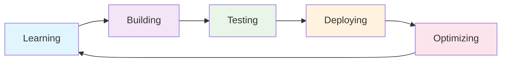

# 👨‍💻 Jayesh Kumar Goyal - Developer Profile

<div align="center">
  
</div>

## 🌟 About Me

I'm a passionate **Full-Stack Developer** and **AI/ML Enthusiast** with a strong foundation in building efficient, scalable applications. My journey spans from mobile development to low-level systems programming, with a particular focus on AI/ML-powered solutions and computer vision applications.

## 🎯 Core Competencies

### 💻 **Full-Stack Development**
- **Frontend**: React, Vue.js, HTML5, CSS3, JavaScript
- **Backend**: Node.js, Django, Flask, Express.js, .NET
- **Mobile**: Flutter, React Native, Native Android/iOS
- **Databases**: MongoDB, MySQL, PostgreSQL, SQLite, DynamoDB

### 🤖 **AI/ML & Data Science**
- **Machine Learning**: Scikit-learn, TensorFlow, PyTorch
- **Computer Vision**: OpenCV, YOLO, MediaPipe
- **Data Processing**: Pandas, NumPy, Matplotlib, Seaborn
- **Natural Language Processing**: NLTK, spaCy, Transformers

### ☁️ **Cloud & DevOps**
- **Cloud Platforms**: AWS, Firebase, Vercel, Google Cloud
- **Containerization**: Docker, Kubernetes
- **CI/CD**: GitHub Actions, Jenkins
- **Monitoring**: Performance optimization and system monitoring

## 🚀 Current Focus

```python
current_learning = {
    "database_optimization": "Advanced query optimization and indexing strategies",
    "algorithms": "Complex data structures and algorithm design patterns",
    "microservices": "Scalable architecture patterns and service design",
    "ai_ml": "Model development, deployment, and MLOps practices",
    "system_optimization": "Performance tuning and monitoring systems"
}
```

## 🏆 Key Achievements

- **🎓 Education**: Strong foundation in computer science and mathematics
- **💼 Experience**: Building end-to-end applications from concept to deployment
- **🤝 Collaboration**: Active in open-source communities and hackathons
- **📚 Learning**: Continuous learner with focus on emerging technologies
- **🎯 Problem Solving**: Passionate about solving complex technical challenges

## 🛠️ Development Philosophy

> *"Clean code is not written by following a set of rules. You don't become a software craftsman by learning a list of heuristics. Professionalism is not a matter of mastering a skill, but of adopting a set of values."* - **Robert C. Martin**

### Core Principles
- **🧹 Clean Code**: Writing maintainable, readable, and efficient code
- **🔄 Continuous Learning**: Staying updated with latest technologies and best practices
- **🤝 Collaboration**: Working effectively in teams and contributing to open source
- **🎯 Problem Solving**: Approaching challenges with analytical thinking
- **📈 Growth**: Constantly improving skills and knowledge base

## 🌟 Fun Facts

- 🎵 **Music**: I code better with lo-fi beats in the background
- ☕ **Fuel**: Coffee is my debugging companion
- 🌙 **Schedule**: Night owl developer (peak productivity at 2 AM)
- 🎮 **Gaming**: Love solving puzzles and strategy games
- 📚 **Learning**: Always exploring new technologies and frameworks

## 🎨 Design & Creativity

- **UI/UX Design**: Figma, Adobe Creative Suite, Canva
- **3D Modeling**: Blender for 3D graphics and visualization
- **Prototyping**: Creating interactive prototypes and mockups
- **Branding**: Developing visual identity and brand guidelines

## 📈 Development Activity

<div align="center">



</div>

## 🎯 Future Goals

- **🚀 Advanced AI/ML**: Deep dive into advanced machine learning and AI research
- **☁️ Cloud Mastery**: Become an expert in cloud architecture and DevOps
- **🏗️ System Design**: Master large-scale system design and architecture
- **📚 Mentoring**: Share knowledge and mentor other developers
- **🌍 Impact**: Build solutions that make a positive impact on society

## 📞 Let's Connect

<div align="center">
  <a href="https://linkedin.com/in/jayeshkumargoyal" target="_blank">
    
  </a>
  <a href="mailto:kumarjayesh012@gmail.com" target="_blank">
    
  </a>
  <a href="https://discordapp.com/users/jayeshkumargoyal" target="_blank">
    
  </a>
</div>

---

<div align="center">
  
</div>
