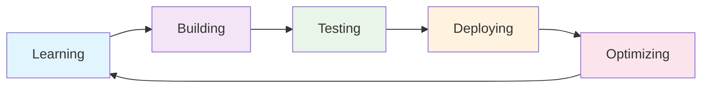

# 👋 Hi there, I'm Jayesh Kumar Goyal

<div align="center">
  
</div>

## 🚀 About Me

I'm a passionate **Full-Stack Developer** and **AI/ML Enthusiast** with expertise in building efficient and scalable applications. My journey spans from Android development to low-level systems programming, with a strong focus on AI/ML-powered solutions.

### 🎯 What I Do
- 🔧 **Full-Stack Development**: Building end-to-end applications with modern frameworks
- 🤖 **AI/ML Solutions**: Developing intelligent systems and computer vision applications
- 📱 **Mobile Development**: Creating cross-platform mobile applications
- 🏗️ **System Architecture**: Designing scalable and efficient systems
- 🧠 **Algorithm Optimization**: Solving complex problems with optimized solutions

### 🌱 Currently Learning
- Database optimization and performance tuning
- Advanced algorithms and data structures
- Scalable microservices architecture
- AI/ML model development and deployment
- System-level optimizations

### 🤝 Collaboration Interests
- Software development projects
- Computer vision applications
- AI/ML research and development
- Hackathon projects and prototypes
- Open source contributions

## 🌐 Connect With Me

<div align="center">
  <a href="https://linkedin.com/in/jayeshkumargoyal" target="_blank">
    
  </a>
  <a href="mailto:kumarjayesh012@gmail.com" target="_blank">
    
  </a>
  <a href="https://discordapp.com/users/jayeshkumargoyal" target="_blank">
    
  </a>
</div> 

## 💻 Tech Stack

<div align="center">

### 🐍 Programming Languages


### 🎨 Frontend Development


### ⚙️ Backend Development


### 📱 Mobile Development


### ☁️ Cloud & DevOps


### 🗄️ Databases


### 🤖 AI/ML & Data Science


### 🎨 Design & Tools


</div>


## 🎯 Current Focus

<div align="center">

```python
def current_learning():
    return {
        "database_optimization": "Advanced query optimization and indexing",
        "algorithms": "Complex data structures and algorithm design",
        "microservices": "Scalable architecture patterns",
        "ai_ml": "Model development and deployment",
        "system_optimization": "Performance tuning and monitoring"
    }
```

</div>

## 🚀 Featured Projects

<div align="center">

| Project | Description | Tech Stack | Status |
|---------|-------------|------------|--------|
| 🎨 **Portfolio Website** | Personal portfolio with modern design | React, Node.js, MongoDB | 🚧 In Progress |
| 🤖 **AI Chatbot** | Intelligent conversational AI | Python, TensorFlow, NLP | 🚧 In Progress |
| 📱 **Mobile App** | Cross-platform mobile application | Flutter, Firebase | 🚧 In Progress |
| 🌐 **Web Dashboard** | Real-time analytics dashboard | React, Django, PostgreSQL | 🚧 In Progress |

</div>

## 📈 Development Activity

<div align="center">



</div>

## 🎨 Design Philosophy

<div align="center">

> *"Clean code is not written by following a set of rules. You don't become a software craftsman by learning a list of heuristics. Professionalism is not a matter of mastering a skill, but of adopting a set of values."* - **Robert C. Martin**

</div>

## 🌟 Fun Facts

<div align="center">

- 🎵 **Music**: I code better with lo-fi beats in the background
- ☕ **Fuel**: Coffee is my debugging companion
- 🌙 **Schedule**: Night owl developer (peak productivity at 2 AM)
- 🎮 **Gaming**: Love solving puzzles and strategy games
- 📚 **Learning**: Always exploring new technologies and frameworks

</div>

---

<div align="center">
  
</div>
